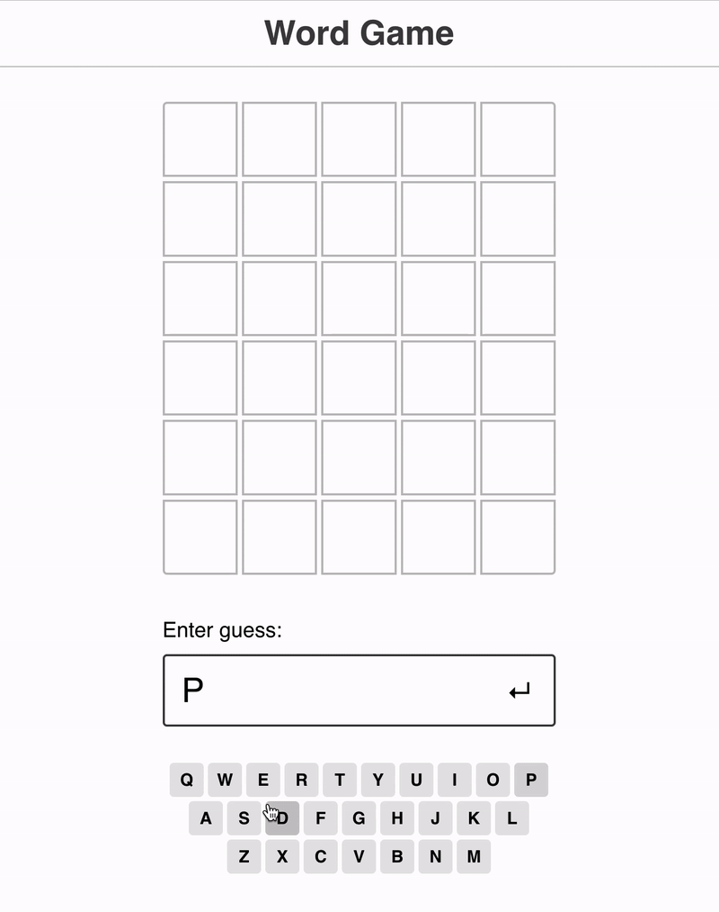

# Word Game

## Demo

https://call007.github.io/word-clone/

## How To Play

### Guess the Wordle in 6 tries.

- Each guess must be a valid 5-letter word.
- The color of the tiles will change to show how close your guess was to the word.

There are 3 possible statuses:

-  **correct** — this slot is perfect. It's the right letter in the right place.
-  **misplaced** — this letter does exist in the word, but in a different slot.
-  **incorrect** — this letter is not found in the word at all.
